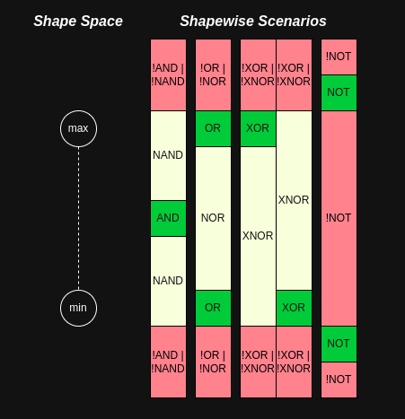

# 🔷 Shapewise

Welcome to the **Shapewise** era — where logic operations meet spatial relationships.

This library provides logic-inspired proximity functions for numeric values within a defined range. Think of it as applying logical gates (`AND`, `OR`, `NOT`, etc.) to numbers based on how "close" they are to various areas of a numeric range.

<center></center>


---

## 📦 Installation

```bash
npm install ?
```

---

## 🧠 Concept

Each function in this library accepts:

- `start` and `end`: Defines the range.
- `value`: The value being evaluated.
- `threshold`: A fraction or number that determines "closeness."

For example, a threshold of `0.1` means "within 10% of the range length" for some functions.

---

## ✨ API

### `and(start, end, value, threshold)`

Returns `true` if the value is near the **center** of the range.

```js
and(0, 10, 5, 1) // true
```

---

### `or(start, end, value, threshold)`

Returns `true` if the value is near the **edges** (top or bottom) of the range.

```js
or(0, 10, 0.5, 0.1)  // true
or(0, 10, 9.5, 0.1)  // true
or(0, 10, 5, 0.1)    // false
```

---

### `xor(start, end, value, threshold)`

Returns `true` if the value is close to **only one** edge of the range.

```js
xor(0, 10, 0.5, 0.1) // true
xor(0, 10, 9.5, 0.1) // true
xor(0, 10, 5, 0.1)   // false
```

---

### `nxor(start, end, value, threshold)`

Returns `true` if the value is either close to **both** edges or **neither** edge.

```js
nxor(0, 10, 0.5, 0.1) // false
nxor(0, 10, 5, 0.1)   // true
```

---

### `not(start, end, value, threshold)`

Returns `true` if the value is **outside** the range, but still within the threshold distance *outside* the range.  
Returns `false` if the value is inside the range.

```js
not(0, 10, -1, 0.2)  // true (near lower bound)
not(0, 10, 11, 0.2)  // true (near upper bound)
not(0, 10, 5, 0.2)   // false
```

---

### `nand(start, end, value, threshold)`

Returns `true` if the value is **within the range** but **not near the center**.  
Returns `false` if value is out of bounds.

```js
nand(0, 10, 1, 1)  // true
nand(0, 10, 5, 1)  // false
```

---

### `nor(start, end, value, threshold)`

Returns `true` if the value is inside the range but **not near the edges**.

```js
nor(0, 10, 5, 0.2)    // true
nor(0, 10, 9.5, 0.2)  // false
```

---

## 🛠 Example Use

```js
import { and, or, xor, not } from '?'

const isCentral = and(10, 20, 15, 2)
const isOnEdge = or(10, 20, 10.5, 0.05)
const isOutsideButClose = not(10, 20, 21, 0.1)
```

---

## 🧪 Testing

You can test with your favorite framework like Jest:

```
npm test
```

---

## 💡 Why "Shapewise"?

Just like bitwise operations act on individual bits, **shapewise** logic acts on numeric *shapes* — how close a value is to the core, the edges, or just outside a defined range. It's ideal for fuzzy logic, UI tolerances, input validation, animation zones, or generative art conditions.

---

## 📄 License

MIT
